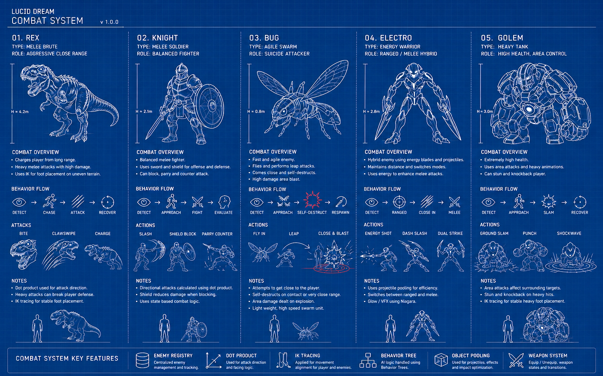
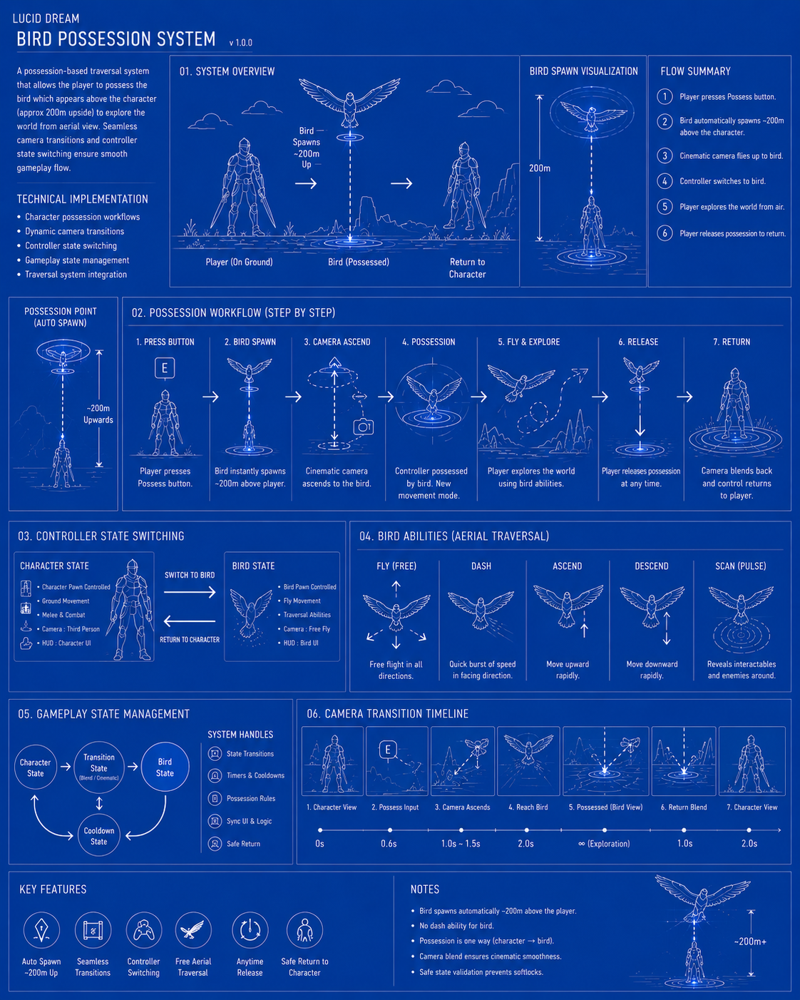
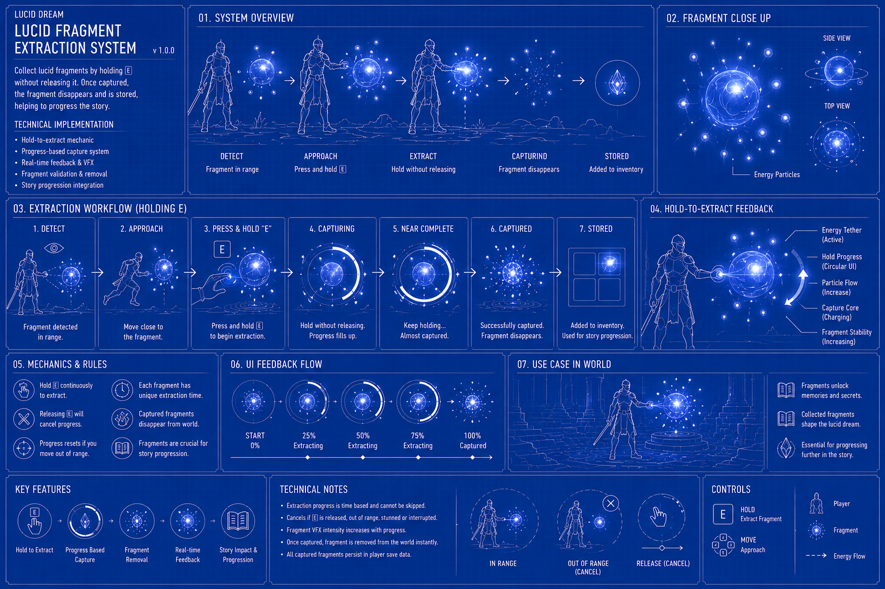
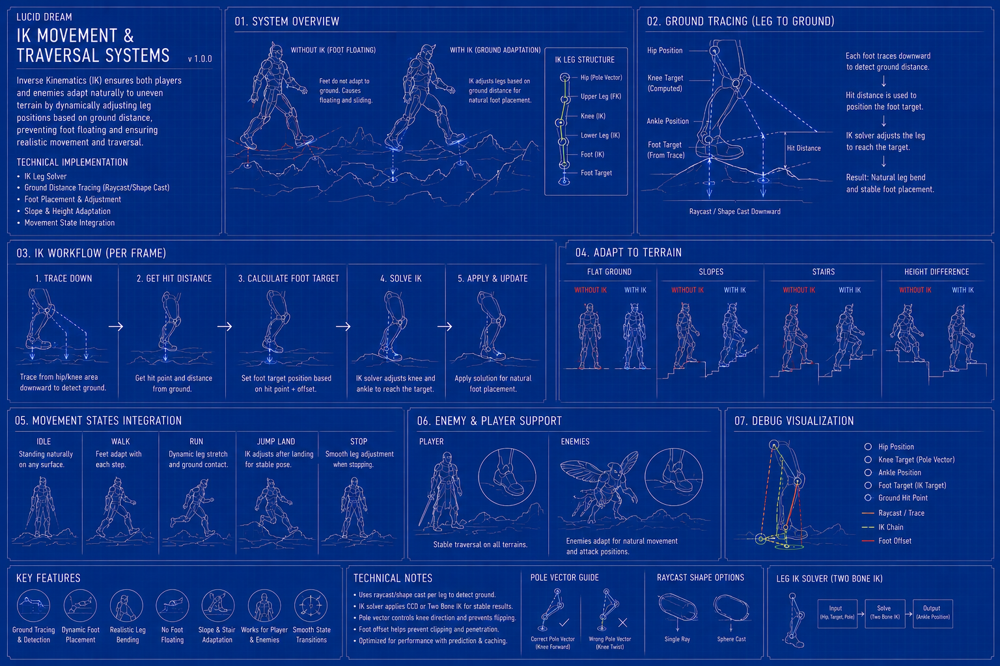
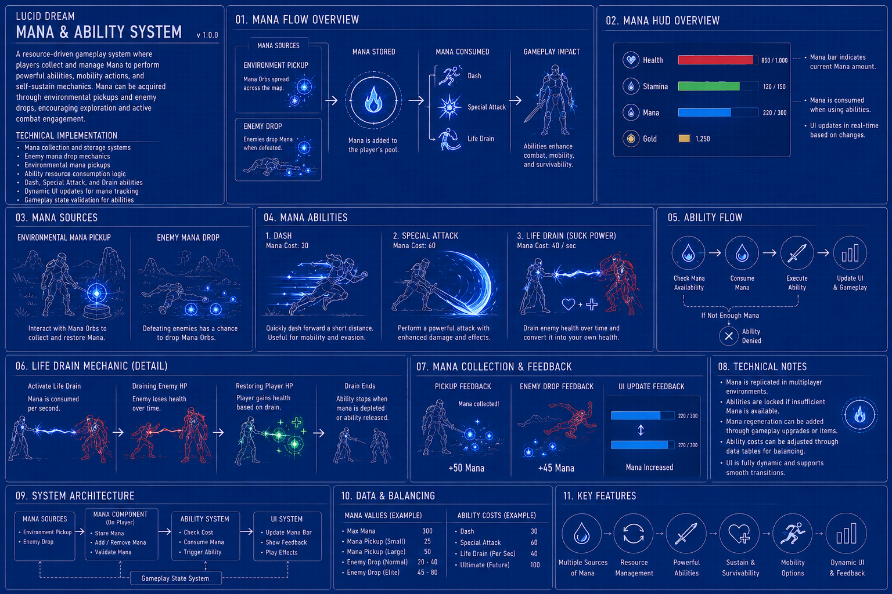

# Project Overview: Lucid Dream

### 🎥 Watch Game Trailer-> https://www.youtube.com/watch?v=T36C9DlpAxc

**Lucid Dream** is a solo-developed Unreal Engine 5.5 gameplay project focused on building and integrating modular gameplay systems using both C++ and Blueprint workflows.

The project was developed as a technical gameplay programming showcase with an emphasis on combat systems, AI behaviors, interaction mechanics, traversal systems, UI frameworks, and cinematic gameplay flow. 

Development focused heavily on gameplay architecture, system communication, and real-time gameplay responsiveness while exploring sci-fi and lucid dream-inspired environments and mechanics.

### Project Details
* **Engine:** Unreal Engine 5.5
* **Role:** Solo Developer
* **Programming:** C++ & Blueprints
* **Project Type:** Gameplay Programming Showcase
* **Genre:** Sci-Fi / Action Adventure
* **Technical Focus:**
  * Gameplay Systems
  * AI Programming
  * Combat Systems
  * Interaction Mechanics
  * UI Frameworks
  * Optimization Workflows
  * Technical Debugging & Packaging

### Key Gameplay Systems Implemented
* Real-time combat and directional attack systems
* IK tracing systems for player and enemy movement alignment
* Enemy AI behavior systems using Behavior Trees and AI Perception
* Bird possession mechanics with cinematic camera transitions
* Dynamic weapon state systems
* Lucid fragment extraction and interaction systems
* Save/load progression systems
* Object pooling workflows for gameplay optimization
* Niagara VFX integration for gameplay feedback
* HUD and gameplay UI systems
* Enhanced Input gameplay architecture
* Motion Warping integration for combat responsiveness

The project also involved solving production and technical workflow challenges including gameplay debugging, packaging workflows, asset management, AI initialization handling, and gameplay state synchronization inside Unreal Engine 5.5.

---

## Core Gameplay Features

### ⚔️ Combat System

🎥 Watch Combat System-> [https://www.youtube.com/watch?v=T36C9DlpAxc](https://www.youtube.com/watch?v=wbSkyf3sGLg)

Implemented a real-time combat system focused on responsive gameplay flow, directional attack handling, and animation-driven combat interactions.
* **Technical Implementation:**
  * Directional attack logic using Dot Product calculations
  * Weapon state handling (equip / unequip systems)
  * Animation montage integration
  * Motion Warping for attack responsiveness
  * Combat state synchronization
  * Hit reaction and gameplay feedback systems
 

   
---
### 🤖 Enemy AI System

🎥 Watch Enemy AI System-> [https://www.youtube.com/watch?v=mc4UjodEDSg](https://www.youtube.com/watch?v=mc4UjodEDSg)

Developed modular enemy AI systems using Unreal Engine AI frameworks for detection, chasing, and combat behavior handling.
* **Technical Implementation:**
  * AI Perception system integration
  * Behavior Tree-based enemy behavior workflows
  * Enemy AI Controller logic in C++
  * Combat targeting systems
  * Enemy registry and management systems
  * Patrol, chase, and attack state handling
 

  
---
### 🦅 Bird Possession System

🎥 Watch Bird Possession System-> [https://www.youtube.com/watch?v=6v7mW6jdfKs](https://www.youtube.com/watch?v=6v7mW6jdfKs)

Implemented a possession-based traversal system allowing the player to transition between character control states with cinematic camera blending.
* **Technical Implementation:**
  * Character possession workflows
  * Dynamic camera transitions
  * Controller state switching
  * Gameplay state management
  * Traversal system integration
 

  
---
### 💎 Lucid Fragment Extraction System

🎥 Watch Lucid Fragment Extraction System-> [https://www.youtube.com/watch?v=u6svv9nm_AI](https://www.youtube.com/watch?v=u6svv9nm_AI)

Designed a gameplay interaction system focused on collecting and extracting lucid fragments tied to environmental storytelling and progression mechanics.
* **Technical Implementation:**
  * Hold interaction systems
  * Gameplay event triggering
  * UI interaction feedback
  * Animation-driven extraction workflows
  * Fragment progression tracking systems
 

 
---
### 🏃‍♂️ IK Movement & Traversal Systems

🎥 Watch IK Movement & Traversal Systems-> [https://www.youtube.com/watch?v=MQcOo6jn6Hw](https://www.youtube.com/watch?v=MQcOo6jn6Hw)

Implemented IK tracing systems to improve gameplay responsiveness and environmental interaction for both player and enemy characters.
* **Technical Implementation:**
  * Foot IK tracing systems
  * Terrain alignment workflows
  * Movement adaptation systems
  * Enemy movement alignment handling
 

 
---
### 🧪 Mana & Ability System
Implemented a resource-driven combat system where players collect and manage Mana to perform advanced combat abilities, traversal actions, and self-sustain mechanics. Mana can be acquired through environmental pickups and enemy drops, encouraging active exploration and aggressive combat engagement.

The system introduces strategic resource management by requiring players to balance offensive abilities, mobility actions, and survivability against available mana reserves.

* **Technical Implementation:**
  * Mana collection and storage systems
  * Enemy mana drop mechanics
  * Environmental mana pickup interactions
  * Ability resource consumption logic
  * Dash ability powered by mana usage
  * Special attack activation systems
  * Health drain (life steal) mechanics
  * Dynamic UI updates for mana tracking
  * Gameplay state validation for ability execution

#### Mana Ecosystem Breakdown
* **Mana Source Types:**
  * Environmental pickups
  * Enemy drop rewards
* **Mana Consumers:**
  * Dash
  * Special Attack
  * Life Drain Ability
 

 

---

## Optimization & Gameplay Framework Systems

Implemented multiple backend gameplay systems to improve scalability, performance, and gameplay organization during development.
* **Technical Implementation:**
  * Object pooling systems
  * Gameplay state management
  * Save/load progression systems
  * Enhanced Input architecture
  * HUD and gameplay UI frameworks
  * Niagara VFX gameplay integration

---

## Technical Problems Solved During Production

### 1. Enemy Attack Overshooting During Combat
* **Problem:** Enemy attack animations occasionally pushed characters beyond the player's position, causing inaccurate melee interactions.
* **Solution:** Adjusted Motion Warping targets, attack ranges, and combat validation checks to ensure enemies remained aligned with their intended target.
* **Result:** Improved combat accuracy and more responsive enemy attack behavior.

### 2. Low Mana Audio Spam
* **Problem:** Repeated ability input while lacking sufficient mana caused the warning sound effect to play continuously.
* **Solution:** Implemented input validation and cooldown checks before triggering low-mana feedback events.
* **Result:** Reduced audio spam and improved player feedback clarity.

### 3. Lock-On Target Persistence
* **Problem:** Lock-On UI elements remained active after the tracked enemy had been eliminated.
* **Solution:** Added target validity checks and automatic cleanup of Lock-On references when enemies were destroyed.
* **Result:** Improved target tracking stability and UI reliability.

### 4. Bird Possession Spawn Failure
* **Problem:** Bird possession occasionally failed due to spawn and state transition issues.
* **Solution:** Refactored bird spawning validation and possession workflow handling to guarantee successful actor creation before control transfer.
* **Result:** Reliable traversal transitions and stable bird possession gameplay.

### 5. Save Game Currency Persistence
* **Problem:** Player currency values were not being restored correctly after loading save data.
* **Solution:** Extended `SaveGame` serialization logic to store and restore currency progression data.
* **Result:** Consistent progression tracking across gameplay sessions.

### 6. Packaging & Shipping Build Failures
* **Problem:** Shipping builds failed due to invalid asset references, corrupted asset dependencies, and external media file path issues.
* **Solution:** Identified broken references, repaired asset dependencies, migrated media resources to valid project locations, and revalidated packaging workflows.
* **Result:** Successfully generated stable shipping builds suitable for distribution.

### 7. Enemy Detection Edge Cases
* **Problem:** AI behavior became inconsistent when players exited detection ranges or rapidly moved between combat and non-combat states.
* **Solution:** Implemented Behavior Tree state validation, AI Perception handling, and fallback combat state logic.
* **Result:** More reliable enemy behavior transitions and improved gameplay consistency.

### 8. Character & Enemy Ground Alignment
* **Problem:** Characters occasionally appeared to float above terrain or clip into uneven surfaces.
* **Solution:** Implemented Foot IK tracing systems for dynamic terrain adaptation and leg alignment.
* **Result:** Improved movement realism and environmental interaction quality.
